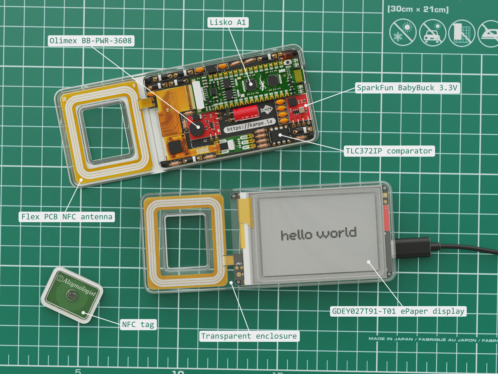

# kampela-soldering-kit

## Overview

Do-it-yourself kit to make your own, fully-functional Kampela signer

## Features
- Easy to solder and self-assembly transaction signer kit
- NFC-powered batteryless operation
- secure vault implemented in EFM32PG23 MCU
- 2.7" ePaper display with touchscreen
- you can fill the assembled kit with transparent UV-cured glue after assembly and tests to make it unchangeable

## Why did we create this?

We want to make kampela design as transparent, verifiable and open-source as possible, that's simple.

## Components

Kampela solder kit consists of several off-the-shelf modules, simple electronic components and 3d printed parts:

**Modules:**
- 1pc - [Lisko A1](https://github.com/vasya-zh/Lisko) EFM32 devboard
- 1pc - [SparkFun BabyBuck 3.3V](https://www.sparkfun.com/products/18357) - step-down converter module 
- 1pc - [Olimex BB-PWR-3608](https://www.olimex.com/Products/Breadboarding/BB-PWR-3608/open-source-hardware) - step-up converter module 12V/24V
- 1pc - [Touch-6pin-adapter](https://github.com/vasya-zh/kampela-soldering-kit/tree/v2/kicad/touch-6pin-adapter) - 6-pin 0.5mm pitch FPC cable adapter for i2c touch screens
- 1pc - [NFC tag](https://github.com/vasya-zh/kampela-soldering-kit/tree/v2/kicad/tag) PCB with M24SR02 NFC EEPROM chip onboard

**PCBs:**
- 1pc - [Base-board](kicad/base-board/) - main Kampela soldering kit PCB
- 1pc - [flex nfc antenna](https://github.com/vasya-zh/kampela-soldering-kit/tree/v2/kicad/flex-coil8/production) PCB

**3d printed parts:**
- 1pc - [Solder kit enclosure](3d-models/solder-kit-enclosure.stl), 3d printed with transparent SLA resin
- 1pc - [NFC tag enclosure](3d-models/nfc-tag-enclosure.stl), 3d printed with transparent SLA resin

**Electronic components:**
- 1pc - [GDEY027T91-T01](https://www.good-display.com/product/259.html) ePaper display
- 1pc - [TLC372IP](https://www.ti.com/lit/ds/symlink/tlc372.pdf?ts=1715700121988&ref_url=https%253A%252F%252Fwww.google.com%252F) - comparator in DIP8 package
- 1pc - [L78L24](https://www.st.com/resource/en/datasheet/l78l.pdf) - 24V linear voltage regulator in TO-92 package 
- 6pcs - [1N5819](https://www.vishay.com/docs/88525/1n5817.pdf) schottky diode 40V 1A
- 1pc - [1N4743A](https://www.nexperia.com/products/diodes/zener-diodes/1N4743A.html) 13V 1W Zener diode
- 1pc - [3mm red LED](https://www.mouser.fi/ProductDetail/Vishay-Semiconductors/TLDR4900?qs=Lv5%252BaqTFJEN9M2YxsERGfA%3D%3D) for NFC field presence indication 

**Capacitors:**
- 1pc - [15pF 50V](https://www.lcsc.com/product-detail/Multilayer-Ceramic-Capacitors-MLCC-Leaded_TORCH-CC4-0805-CG-50V-15pF-J_C123158.html) ceramic capacitor
- 2pcs - [100pF 50V](https://www.lcsc.com/product-detail/Multilayer-Ceramic-Capacitors-MLCC-Leaded_Murata-Electronics-RCE5C2A101J0DBH03A_C1622101.html) ceramic capacitor
- 2pcs - [0.1uF 50V](https://www.lcsc.com/product-detail/Multilayer-Ceramic-Capacitors-MLCC-Leaded_KNSCHA-178MU0006_C5632430.html) ceramic capacitor
- 2pcs - [1uF 50V](https://www.lcsc.com/product-detail/Multilayer-Ceramic-Capacitors-MLCC-Leaded_KNSCHA-178MU0010_C5632434.html) ceramic capacitor
- 1pc - [220uF 25V](https://www.lcsc.com/product-detail/Aluminum-Electrolytic-Capacitors-Leaded_CX-Dongguan-Chengxing-Elec-KM227M025E11RR0VH2FP0_C12450.html) aluminium capacitor d6.3mm\*11mm

**Resistors:**
- 4pcs - [10k 0.125w](https://www.lcsc.com/product-detail/Through-Hole-Resistors_VO-MF1-8W-10K-1-ST26_C2903381.html) resistor
- 6pcs - [47k 0.125w](https://www.lcsc.com/product-detail/Through-Hole-Resistors_Futaba-Elec-RNU18F4702A520NH_C274421.html) resistor
- 1pc - [300k 0.125w](https://www.lcsc.com/product-detail/Through-Hole-Resistors_TyoHM-RN-1-8W-300K-F-T-B-A1_C433482.html) resistor

Complete CSV BOM can be found [here](docs/kampela-soldering-kit-BOM.csv)

## Assembly instructions

Assembly instructions can be found here: [/docs/assembly-manual.md](docs/assembly-manual.md)

!Note: don't fill your assembly with transparent UV adhesive before you fully test it and flash it with the right firmware.  

## Flashing and testing

Flashing and testing instructions can be found here: [/docs/flashing-n-testing.md](docs/flashing-n-testing.md)

## Using your Kampela Solder Kit

You can use your solder kit as a transaction signer with the real [Kampela firmware](https://github.com/Kalapaja/kampela-firmware)

To do that you need to flash it with the latest [binary firmware released](https://github.com/Kalapaja/kampela-firmware/tags) or build it from the [source code](https://github.com/Kalapaja/kampela-firmware)

Or you can make your version of the firmware and hardware with all needed customisation.

## How to produce your own Kampela Solder Kit

You can get the kit in [kampe.la](https://kampe.la) shop

Or make your kit. To do that you need:
- order PCBs from your favourite PCB manufacturer. Gerber files can be found here: [base-board](https://github.com/vasya-zh/kampela-soldering-kit/tree/v2/kicad/base-board/production), [flex-antenna](https://github.com/vasya-zh/kampela-soldering-kit/tree/v2/kicad/flex-coil8/production)
- order modules and electronic components, see the [full BOM](docs/kampela-soldering-kit-BOM.csv)
- order or print enclosures with transparent SLA resin. STL and STEP files can be found [here](3d-models/)
- if you want you can also make your version of [Lisko A1](https://github.com/vasya-zh/Lisko) board and [FPC adapter](https://github.com/vasya-zh/kampela-soldering-kit/tree/v2/kicad/touch-6pin-adapter) board. Overwise contact [kampela team](https://kampe.la)

## TODO
- !change ePaper and touch screen RESET signal polarity in test and release firmware! 

## Final thoughts

## Contributors

- [Vasilii Zhuravskii](https://github.com/vasya-zh) - solder kit v2 design, schematics, boards design, DFM, docs, tests

- [Yuri Ilin](https://www.youtube.com/@katsuk) - solder kit v1 design, schematics, flasher firmware, EFM32 test firmware in C with E-INK and other features

This project was made at [Alzymologist Oy](https://github.com/alzymologist) as a part of [Kampela](https://kampe.la) project.
