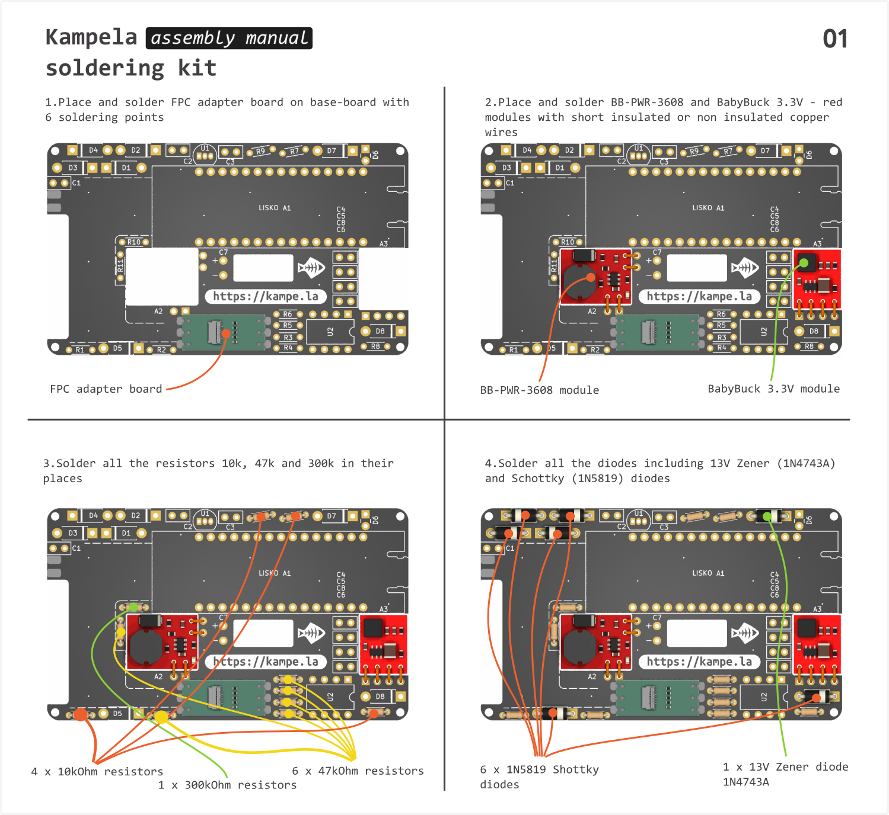
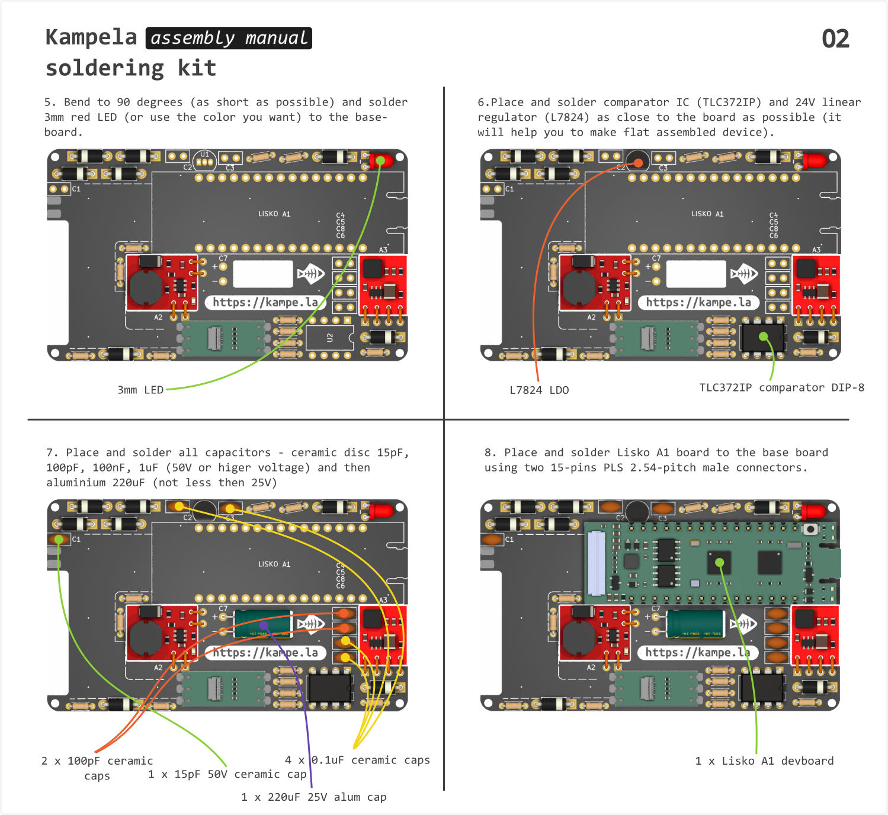
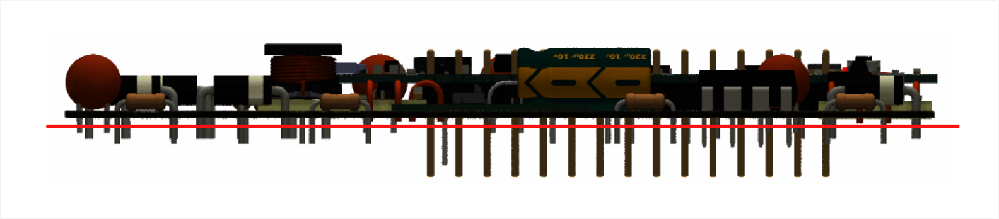

## Assembly instructions

> [!CAUTION]
> Don't forget to use a safety glass and fume extractor (simple 80mm PC vent suits too) too prevent cancer and eye deseases.
> The sun is bright, the water is wet, a soldering iron is hot - be carefull!

0. First you need to solder the base-board with soldering iron, soldering wire and a lot of flux

	

	

1. Perfect! Now lets cut all the wires on the back side of the base board not higher than 0.5mm and clean the board from flux remains with isopropanol or other solvent

	

2. Solder the flex coil to the base board with 2 soldering points as shown below. Use water cleanable or non-clean flux, we don't want to demage flex coil sticker layer with solvent.

3. Stick the flex dumper to the back side of the 2.7" E-INK display to protect it from PCB back wires and for pushing it in place 

3. Place 2.7" E-INK display with a touch screen to the enclosure and push it to the upper edge of it's place to align visible area with enclosure window. No need to fix it at this stage, it will be secured in place with a flex dumper after fixing the base-board PCB.

4. Install assembled base board to the enclosure, getting E-INK and Touch screen flex cables outside. Fix it to enclosure with four M1.6x3 self-tapping screws.

5. Bend and insert the E-INK and Touch screen flex cables (orange ones) into their connectors - E-INK cable goes to Lisko 24 pin connector, touch screen cable goes to fpc adapter 6 pin connector.

6. Unstick a protective layer on a flex coil and stick the coil in it's place inside the enclosure.

7. Now let's assemble a dummy NFC tag used to initiate NFC communication with a phone. 

	You can use any NFC ISO/IEC 14443 Type A compatible tag you want - it will work with Siltti SDK.

	Or use [kit's NFC tag](https://github.com/Kalapaja/kampela-hardware/tree/main/tag) based on [M24SR02-YMC6T/2](https://www.st.com/en/nfc/m24sr02-y.html) 2-Kbit EEPROM NFC memory

	Install the tag PCB inside a 3d printed enclosure. You can stick it and fill with transparent UV-adhesive if you want, but don't forget to test the tag before, for example with NFC Tools. It should be findable and possible to read it's uID, that's enouph for our tast.

	You can use the tag on a key chain with a peace of strong wire. Without it Kampela won't work.

8. Install a companion tag to Kampela enclosure.

7. You've done it! Let's get some Club-Mate, it was a long day!
