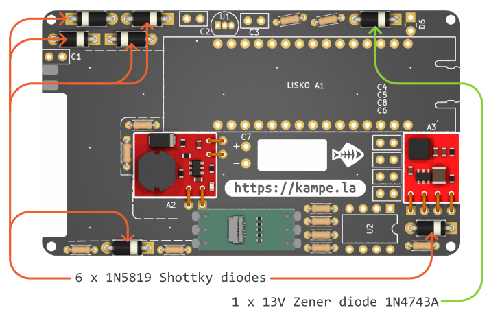

## Assembly manual

> [!WARNING]
> Use the safety glass and fume extractor (simple 80mm PC vent suits too) to prevent cancer and eye deseases. 
> The sun is bright, the water is wet, a soldering iron is hot - be carefull!

## Base-board assembly

0. Tools and materials:
- a soldering iron, 
- a soldering wire, 
- a lot of flux, 
- any cleaning solvent to clean flux after assembly (isopropanol etc) 
- and a good side cutters. 

1. Place and solder FPC adapter board on base-board with 6 soldering points:

2. Place and solder BB-PWR-3608 and BabyBuck 3.3V - red modules with short insulated or non insulated copper wires:
	

3. Solder all the resistors 10k, 47k and 300k in their places

4. Solder all the diodes including 13V Zener (1N4743A) and Schottky (1N5819) diodes

5. Bend to 90 degrees (as short as possible) and solder 3mm red LED (or use the color you want) to the base-board. Check the polarity on the bottom side of the board.

6. Place and solder comparator IC (TLC372IP) and 24V linear regulator (L7824) as close to the board as possible (it will help you to make flat assembled device).

7. Place and solder all capacitors - ceramic disc 15pF, 100pF, 100nF, 1uF (50V or higer voltage) and then aluminium 220uF (not less then 25V)

8. Place and solder Lisko A1 board to the base board using two 15-pins PLS 2.54-pitch male connectors.

9. Perfect! Now lets cut all the wires on the back side of the base board not higher than 0.5mm and clean the board from flux remains with isopropanol or other solvent

2. Solder the flex coil to the base board with 2 soldering points as shown below. Use water cleanable or non-clean flux, we don't want to demage flex coil sticker layer with solvent.

3. Stick the flex dumper to the back side of the 2.7" E-INK display to protect it from PCB back wires and for pushing it in place 

3. Place 2.7" E-INK display with a touch screen to the enclosure and push it to the upper edge of it's place to align visible area with enclosure window. No need to fix it at this stage, it will be secured in place with a flex dumper after fixing the base-board PCB.

4. Install assembled base board to the enclosure, getting E-INK and Touch screen flex cables outside. Fix it to enclosure with four M1.6x3 self-tapping screws.

5. Bend and insert the E-INK and Touch screen flex cables (orange ones) into their connectors - E-INK cable goes to Lisko 24 pin connector, touch screen cable goes to fpc adapter 6 pin connector.

6. Unstick a protective layer on a flex coil and stick the coil in it's place inside the enclosure.

7. Now let's assemble a dummy NFC tag used to initiate NFC communication with a phone. 

	You can use any NFC ISO/IEC 14443 Type A compatible tag you want - it will work with Siltti SDK.

	Or use [kit's NFC tag](https://github.com/Kalapaja/kampela-hardware/tree/main/tag) based on [M24SR02-YMC6T/2](https://www.st.com/en/nfc/m24sr02-y.html) 2-Kbit EEPROM NFC memory

	Install the tag PCB inside a 3d printed enclosure. You can stick it and fill with transparent UV-adhesive if you want, but don't forget to test the tag before, for example with NFC Tools. It should be findable and possible to read it's uID, that's enouph for our tast.

	You can use the tag on a key chain with a peace of strong wire. Without it Kampela won't work.

8. Install a companion tag to Kampela enclosure.

7. You've done it! Let's get some Club-Mate, it was a long day!
